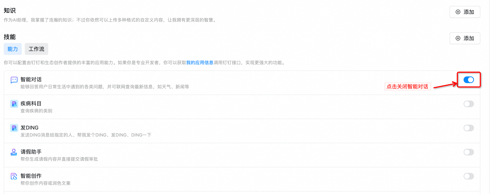

import Tabs from '@theme/Tabs';
import TabItem from '@theme/TabItem';

# 3. 开通直通模式


### 步骤一: 创建自定义能力


### 步骤二: 编写接口的 Yaml 描述文件，我们这里以天气查询为例
:::caution注意事项
1. 使用直通模式，所有的参数都必须只能通过 x-dingtalk-context 来从上下文中获取。
2. 描述文件中只能定义一个接口。
:::

<Tabs>
<TabItem value="GET_STREAM" label="GET请求格式(Stream协议)" default>

```yaml
openapi: 3.0.1
info:
  title: 天气查询
  description: 按地区和日期来查看天气信息，了解气温、湿度、风向等信息。非真实天气数据，仅用于演示，请勿在生产中使用。
  version: v1.0.0
x-dingtalk-protocol: stream
paths:
  /v1/actions/example/weather/get:
    get:
      description: 查询特定地区的天气信息
      summary: 查看天气
      operationId: GetCurrentWeather
      parameters:
        - name: input
          in: query
          description: 输入信息
          required: true
          schema:
            type: string
            x-dingtalk-context:
              property: currentInput
              format: raw
        - name: sender
          in: query
          description: 请求人
          required: true
          schema:
            type: string
            x-dingtalk-context:
              property: currentUser
              format: userId
        - name: inputAttribute
          in: query
          description: 输入信息属性
          required: true
          schema:
            type: string
            x-dingtalk-context:
              property: currentInput
              format: attribute
        - name: corpId
          in: query
          description: 组织信息
          required: true
          schema:
            type: string
            x-dingtalk-context:
              property: currentOrg
              format: corpId
      responses:
        '200':
          description: OK
          content:
            application/json:
              schema:
                $ref: '#/components/schemas/GetWeatherResponse'
components:
  schemas:
    GetWeatherResponse:
      type: object
      properties:
        location:
          type: string
          description: 查询天气结果对应的城市和地区
        date:
          type: string
          description: 查询天气结果对应的日期
        text:
          type: string
          description: 天气现象，晴天、多云等
        temperature:
          type: number
          description: 气温，单位：摄氏度
        humidity:
          type: number
          description: 湿度
        wind_direction:
          type: string
          description: 风向
```
</TabItem>

<TabItem value="POST_STREAM" label="POST请求格式(Stream协议)" default>

```yaml
openapi: 3.0.1
info:
  title: 天气查询
  description: 按地区和日期来查看天气信息，了解气温、湿度、风向等信息。非真实天气数据，仅用于演示，请勿在生产中使用。
  version: v1.0.0
## 推荐使用钉钉 Stream 模式，无需提供公网域名(https://open.dingtalk.com/document/ai-dev/actions-advanced-settings#dc65a46ae9nis)
x-dingtalk-protocol: stream
paths:
  /v1/actions/example/weather/get:
    post:
      description: 查询特定地区的天气信息
      summary: 查看天气
      operationId: GetCurrentWeather
      requestBody:
        content:
          application/json:
            schema:
              type: object
              properties:
                input:
                  type: string
                  description: 输入信息
                  x-dingtalk-context:
                    property: currentInput
                    format: raw
                attribute:
                  type: string
                  description: 输入属性
                  x-dingtalk-context :
                    property: currentInput
                    format: attribute
                sender:
                  type: string
                  description: 发送人UserId
                  x-dingtalk-context:
                    property: currentUser
                    format: userId
                corpId:
                  type: string
                  description: 组织信息
                  x-dingtalk-context:
                    property: currentOrg
                    format: corpId
      parameters:
        - name: input
          in: query
          description: 输入信息
          required: true
          schema:
            type: string
            x-dingtalk-context:
              property: currentInput
              format: raw
        - name: sender
          in: query
          description: 请求人
          required: true
          schema:
            type: string
            x-dingtalk-context:
              property: currentUser
              format: userId
      responses:
        '200':
          description: OK
          content:
            application/json:
              schema:
                $ref: '#/components/schemas/GetWeatherResponse'
components:
  schemas:
    GetWeatherResponse:
      type: object
      properties:
        location:
          type: string
          description: 查询天气结果对应的城市和地区
        date:
          type: string
          description: 查询天气结果对应的日期
        text:
          type: string
          description: 天气现象，晴天、多云等
        temperature:
          type: number
          description: 气温，单位：摄氏度
        humidity:
          type: number
          description: 湿度
        wind_direction:
          type: string
          description: 风向
```
</TabItem>

<TabItem value="GET_HTTP" label="GET请求格式(HTTP协议)" default>

```yaml
openapi: 3.0.1
info:
  title: 天气查询
  description: 按地区和日期来查看天气信息，了解气温、湿度、风向等信息。非真实天气数据，仅用于演示，请勿在生产中使用。
  version: v1.0.0
servers:
  - url: https://action-example.dingtalk.com
paths:
  /v1/actions/example/weather/get:
    get:
      description: 查询特定地区的天气信息
      summary: 查看天气
      operationId: GetCurrentWeather
      parameters:
        - name: input
          in: query
          description: 输入信息
          required: true
          schema:
            type: string
            x-dingtalk-context:
              property: currentInput
              format: raw
        - name: sender
          in: query
          description: 请求人
          required: true
          schema:
            type: string
            x-dingtalk-context:
              property: currentUser
              format: userId
        - name: inputAttribute
          in: query
          description: 输入信息属性
          required: true
          schema:
            type: string
            x-dingtalk-context:
              property: currentInput
              format: attribute
        - name: corpId
          in: query
          description: 组织信息
          required: true
          schema:
            type: string
            x-dingtalk-context:
              property: currentOrg
              format: corpId
      responses:
        '200':
          description: OK
          content:
            application/json:
              schema:
                $ref: '#/components/schemas/GetWeatherResponse'
components:
  schemas:
    GetWeatherResponse:
      type: object
      properties:
        location:
          type: string
          description: 查询天气结果对应的城市和地区
        date:
          type: string
          description: 查询天气结果对应的日期
        text:
          type: string
          description: 天气现象，晴天、多云等
        temperature:
          type: number
          description: 气温，单位：摄氏度
        humidity:
          type: number
          description: 湿度
        wind_direction:
          type: string
          description: 风向
```
</TabItem>
<TabItem value="POST_HTTP" label="POST请求格式(HTTP协议)" default>

```yaml
openapi: 3.0.1
info:
  title: 天气查询
  description: 按地区和日期来查看天气信息，了解气温、湿度、风向等信息。非真实天气数据，仅用于演示，请勿在生产中使用。
  version: v1.0.0
servers:
  - url: https://action-example.dingtalk.com
paths:
  /v1/actions/example/weather/get:
    post:
      description: 查询特定地区的天气信息
      summary: 查看天气
      operationId: GetCurrentWeather
      requestBody:
        content:
          application/json:
            schema:
              type: object
              properties:
                input:
                  type: string
                  description: 输入信息
                  x-dingtalk-context:
                    property: currentInput
                    format: raw
                attribute:
                  type: string
                  description: 输入属性
                  x-dingtalk-context :
                    property: currentInput
                    format: attribute
                sender:
                  type: string
                  description: 发送人UserId
                  x-dingtalk-context:
                    property: currentUser
                    format: userId
                corpId:
                  type: string
                  description: 组织信息
                  x-dingtalk-context:
                    property: currentOrg
                    format: corpId
      parameters:
        - name: input
          in: query
          description: 输入信息
          required: true
          schema:
            type: string
            x-dingtalk-context:
              property: currentInput
              format: raw
        - name: sender
          in: query
          description: 请求人
          required: true
          schema:
            type: string
            x-dingtalk-context:
              property: currentUser
              format: userId
      responses:
        '200':
          description: OK
          content:
            application/json:
              schema:
                $ref: '#/components/schemas/GetWeatherResponse'
components:
  schemas:
    GetWeatherResponse:
      type: object
      properties:
        location:
          type: string
          description: 查询天气结果对应的城市和地区
        date:
          type: string
          description: 查询天气结果对应的日期
        text:
          type: string
          description: 天气现象，晴天、多云等
        temperature:
          type: number
          description: 气温，单位：摄氏度
        humidity:
          type: number
          description: 湿度
        wind_direction:
          type: string
          description: 风向
```
</TabItem>
</Tabs>

### 步骤三: 关闭智能对话


:::caution注意事项
必须关闭**智能对话**才可以成功开通直通模式
:::

### 参考文档
[获取运行上下文](https://open.dingtalk.com/document/ai-dev/actions-advanced-settings#b6788d573apjp)